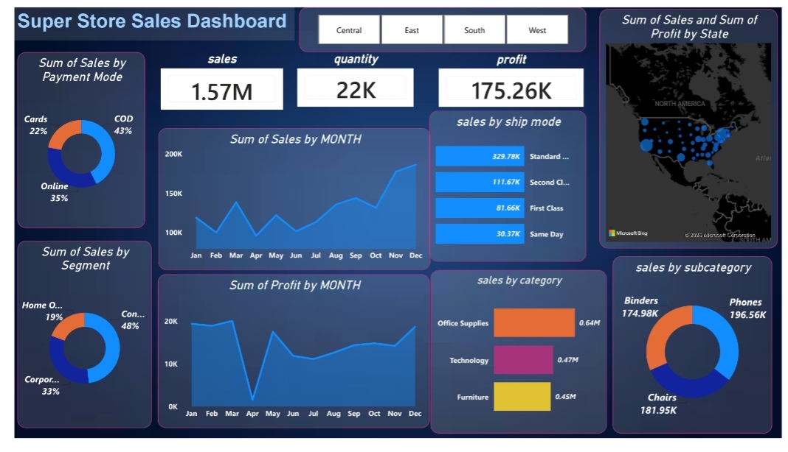

# Super Store Sales Dashboard - Power BI

Interactive business intelligence dashboard analyzing retail sales performance using the Superstore dataset.

### **Live Preview**
📊 [View PDF Screenshot](superstore_dashboard_preview.pdf) | 📁 [Download PBIX File](superstore_dashboard.pbix)

### **Key Metrics**
- **Total Sales**: 1.57M 
- **Total Quantity**: 22K units
- **Total Profit**: 175.26K

### **Dashboard Features**
- **KPI Cards**: Sales, Quantity, Profit with region slicers: Central, East, South, West
- **Payment Analysis**: COD 43%, Online 35%, Cards 22%
- **Customer Segmentation**: Consumer 48%, Corporate 33%, Home Office 19%
- **Monthly Trends**: Sales & Profit with proper chronological sorting via 'Sort by Column'
- **Product Analysis**: By Category, Subcategory, and Ship Mode
- **Geographic View**: Map visualization of Sales & Profit by State

### **Technical Skills Demonstrated**
- **Data Modeling**: Built calendar table + month number column to fix chronological sorting
- **DAX**: Custom measures for KPIs
- **Visualization**: Line/Area charts, Donut charts, Bar charts, Filled maps, Cards
- **UX Design**: Dark theme, consistent styling, interactive filters

### **Key Business Insights**
1. **Seasonality**: Clear Q4 sales spike in Nov-Dec, significant profit dip in April
2. **Shipping Impact**: Standard Class drives 329.78K sales vs 30.37K for Same Day
3. **Top Products**: Phones 196.56K, Chairs 181.95K, Binders 174.98K lead subcategories
4. **Payment Trends**: COD remains dominant at 43% despite digital options
